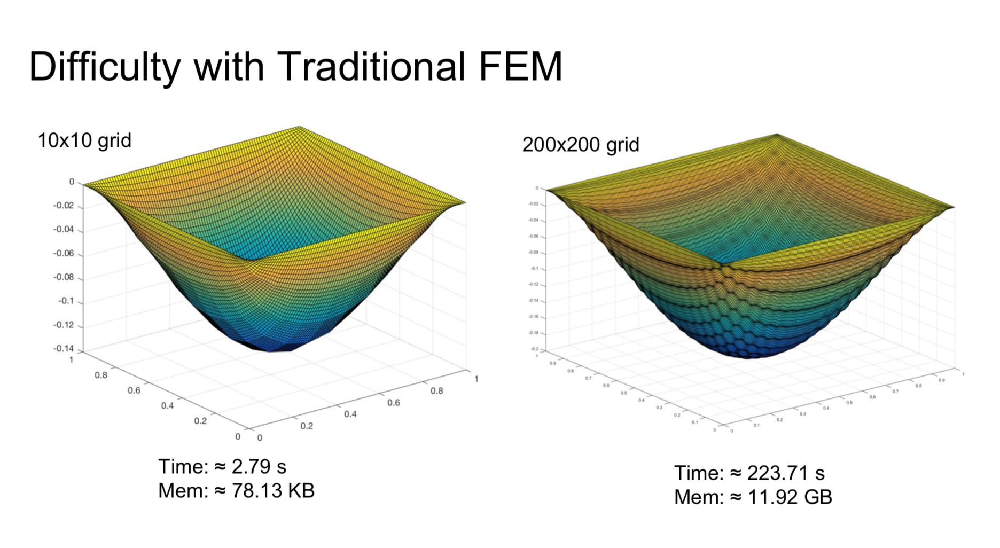
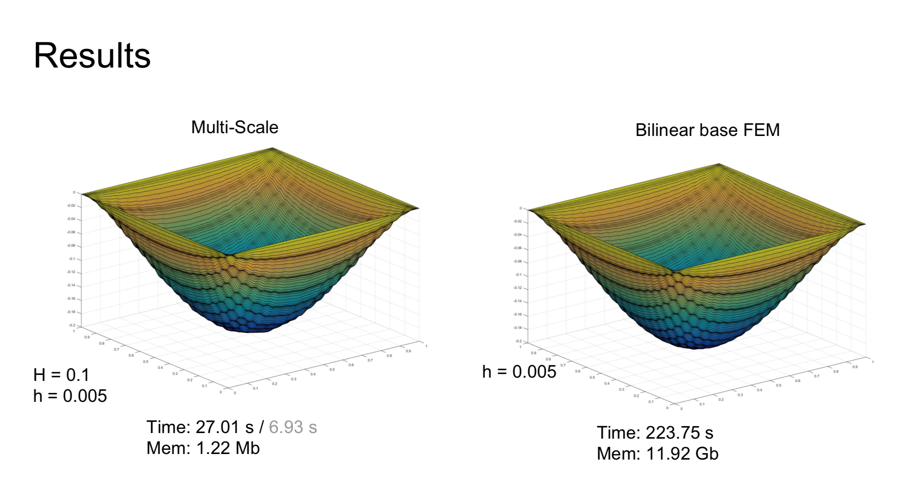

# Multiscale-FEM
This repo contains matlab code for multiscale finite element method. We implemented the multiscale finite element method proposed in Xiaohui Wu's [paper](docs/MsFEM.pdf). Check our [presentation](docs/presentation.pdf). The implementation detail is in the [report](docs/report.pdf). This project got the highest score in the class of Computational Mathematics II. 

For traditional FEM, in order to capture the small scale information of periodic media with high frequency, very fine grid should be used. The size of the problem could be very large which is expensive to solve. 

Using multiscale FEM, we can get similar results with much coarser grid.
